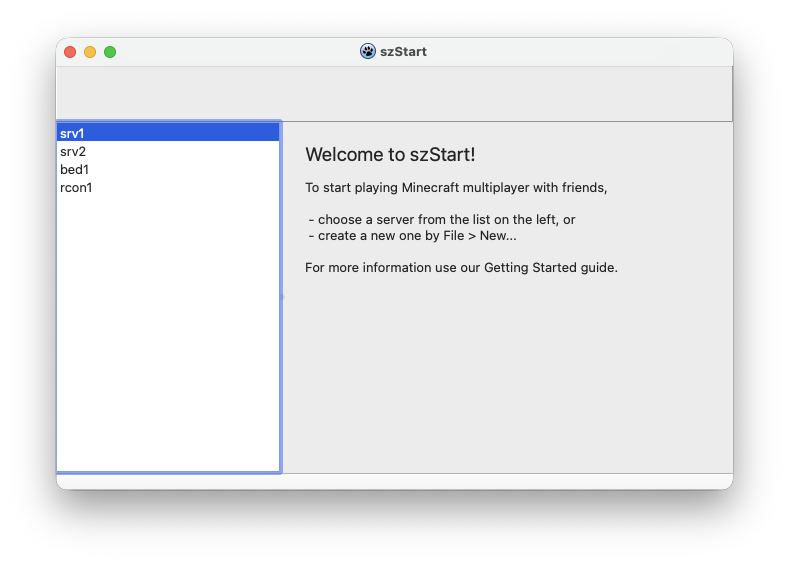

# szStart

> The project is in initial state, therefore no ready-to-go binaries, or even working builds.

</img>

Cross-platform Minecraft Server GUI written in Lazarus / FPC.

## Aims of this project

This application aims the easy creation of Minecraft Server on-the-fly, and managing it via GUI.

## Supported systems

Planned targets: 
- Windows 7 or newer
- Linux with Qt6 support
- macOS Big Sur or newer

## Third-party dependencies

In binary form, the program is compiled and linked as a single executable, distributed under the GPLv2-only license. The corresponding source code is available via this repository or distributed alongside the software.

### Internal packages

This project relies on the following internal packages configured in the Lazarus Project Options:

- **FPC RTL & Lazarus LCL** (FPC modified LGPL)
- **mORMot 2** (Dual/Tri-licensed: MPL v1.1 or later / GPL v2.0 or later / LGPL v2.1 or later)
- **SQLite3** via `mormot.db.raw.sqlite3.static` (Public Domain)

### External libraries

This project uses the following external libraries, which are included as git submodules in /libraries.

- libsodium (ISC license) - https://github.com/jedisct1/libsodium
- miniupnpc (BSD-like license) - https://github.com/miniupnp/miniupnp

## Other source indications

Minecraft related informations, like `server.properties` entries, and so on from [minecraft.fandom.com](https://minecraft.fandom.com/wiki/Server.properties).